# Node.js App Deployment on Amazon Linux

This README file demonstrates how to deploy and run a **Node.js application** on an **Amazon Linux** server using **PM2** for process management.
<br> It is perfect for beginners who are setting up a Node.js backend application in the cloud.
---

## ➤ Prerequisites
Ensure the following are installed on your system:
- **Amazon Linux** OS
- **Node.js**
<br>Node.js is required to run JavaScript code on the backend.
- **Git**
<br> Used for cloning and managing code repositories.
- **PM2** (Process manager)
<br> Keeps your Node.js app running continuously and handles restarts automatically.

---

## ➤ STEPS

After launching the Amazon Linux EC2 instance, Follow these commands step-by-step:

### Step 1: Update the server
Updating your server ensures all software packages are up to date.
```bash
sudo yum update
```
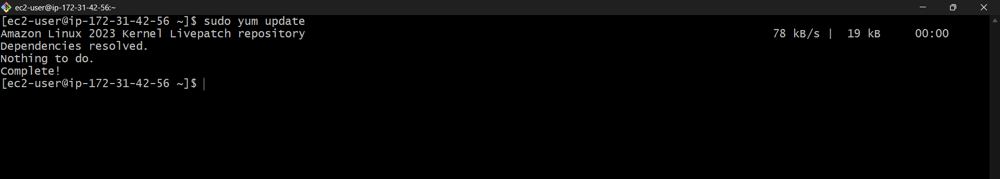

---

### Step 2: Install Node.js and npm and Verify installation:
```
sudo yum install nodejs -y
sudo yum install npm -y
```
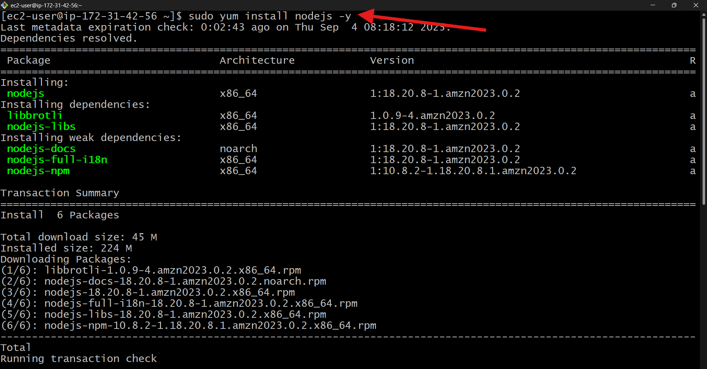
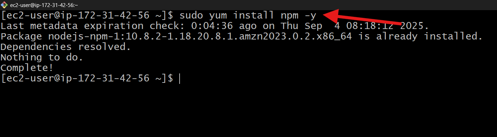

- Verify installation
```
node --version
npm --version
```
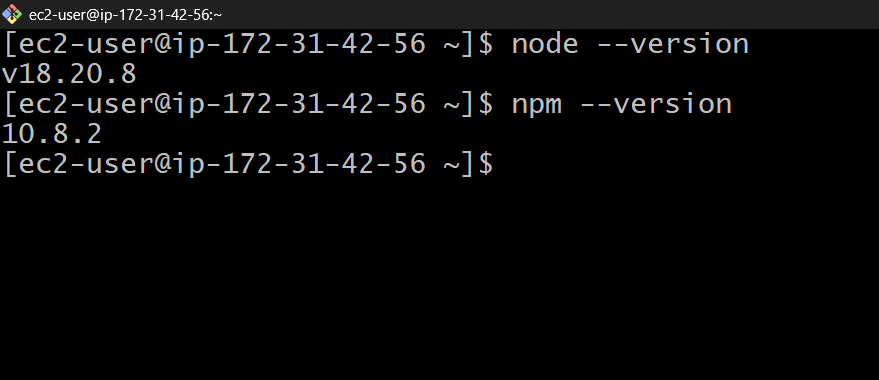


---

### Step 3: Install Git and Verify installation:
Here Git is essential for downloading project source code from repositories like GitHub.
```
sudo yum install git -y
```
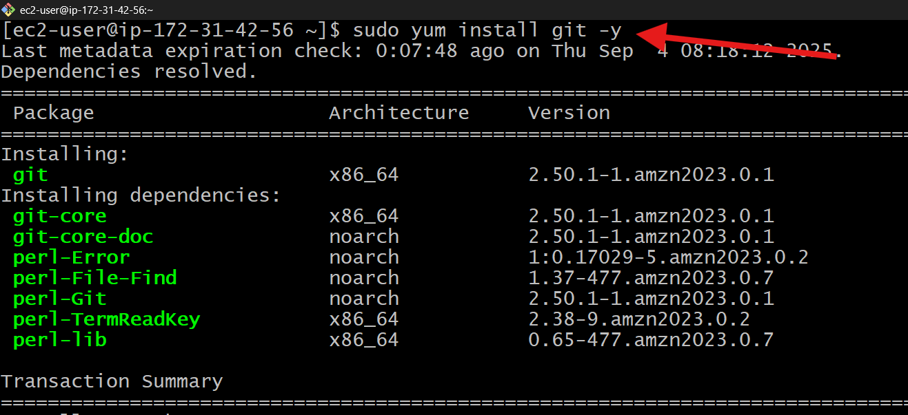

- Verify installation
```
git --version
```
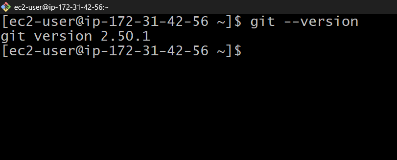


---

### Step 4: Clone the Repository
Use git clone to download your Node.js project from GitHub.
```
sudo git clone https://github.com/username/node-app.git
cd node-app/
```
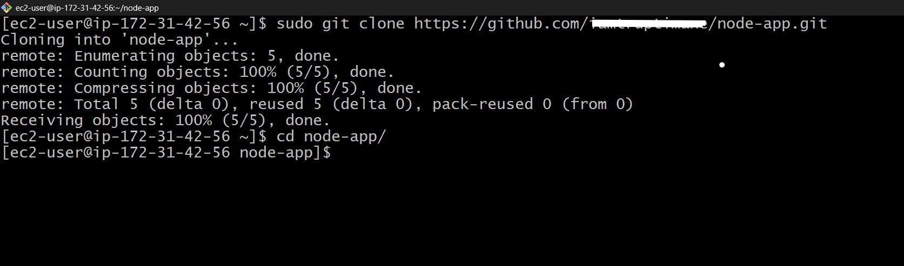

---

### Step 5: Install Project Dependencies
The package.json file contains all required packages for the project.
Run the following command to install them.
```
sudo npm install
```
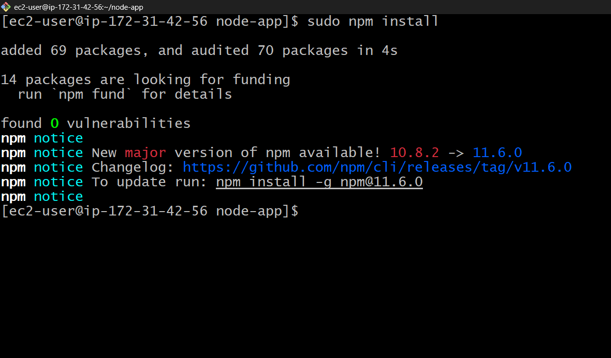

---
### ➤ Running the Application

Step 6: Run the Application
```
node app.js
```
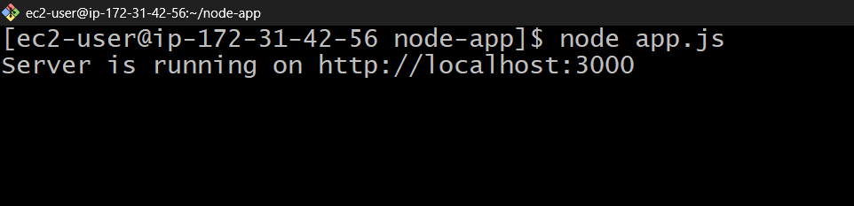


- Check it by running the public IP address along with port 3000 in the browser
<br>
**example:- 'http://public_ip:3000'**

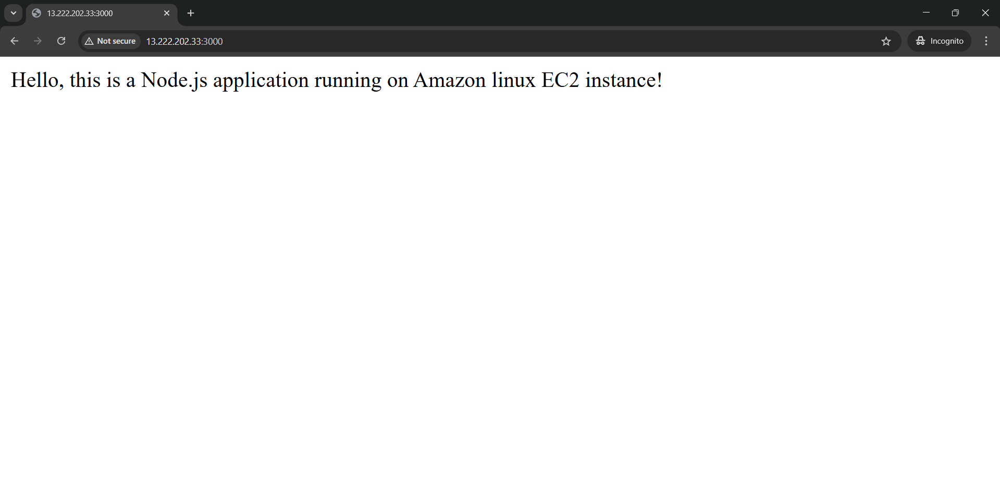
#### Tip:

- Press CTRL + C to stop the application.

- Running it this way will stop the app if you close the terminal, so it's better to use PM2 for production.

---

### ➤ Using PM2 for Process Management
PM2 is a production-grade process manager that ensures your app runs continuously.
It restarts the app if it crashes and allows easy monitoring.

### Step 7: Install PM2 globally

Install PM2 globally:
-  This will ensure your app runs continuously in the background.
```
sudo npm install -g pm2
```
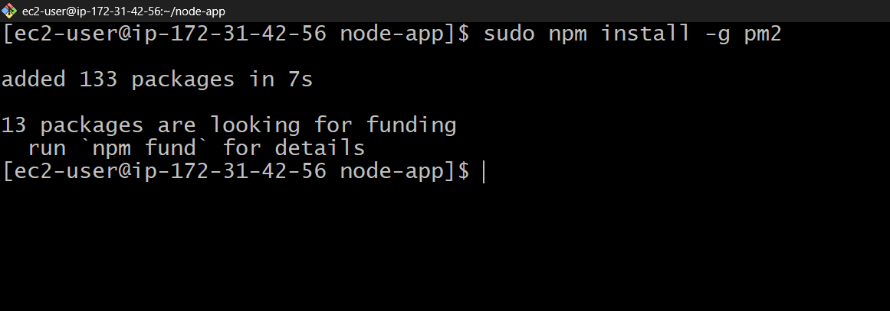

---

### Step 8: Start the app with PM2 and Check the site:
```
pm2 start app.js
```
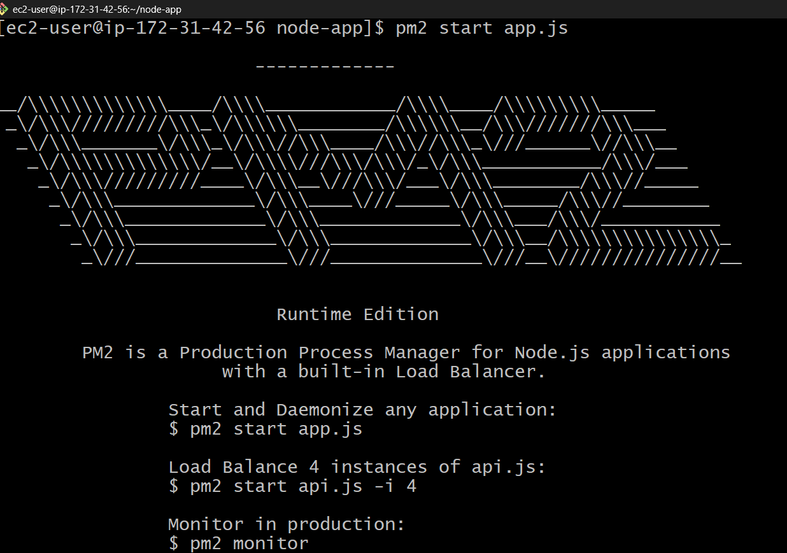

- Check App:


### Step 9: Monitor your application

Check running processes:
```
pm2 list
```
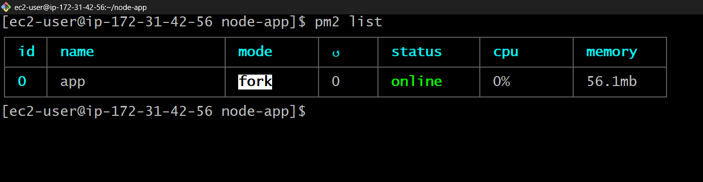

---
### ➤ Project Structure
```
node-app/
│
├── app.js          # Main application file
├── package.json    # Project dependencies
└── README.md       # Documentation
```

---

### ➤ Built With

- Amazon Linux - Cloud server OS

- Node.js - JavaScript runtime for backend development

- PM2 - Process Manager for Node.js to keep the app running continuously in background

- Git - Version control

---

### ➤ Notes

- Make sure port 3000 is open in your firewall/security group.

- Use PM2 for production to keep your app running even after server restarts. 

---

### ➤ Summary:
This guide provided a complete walkthrough for deploying a Node.js application on an Amazon Linux server with PM2 for process management. By following these steps, you have set up a scalable and reliable environment where your application stays live, automatically restarts on failures, and runs seamlessly in the background.

---

### ➤ Final Thoughts:
Deploying a Node.js application for the first time can feel overwhelming. However, once you understand the steps, the process becomes smooth. By completing this setup, you have taken your first step into backend deployment and cloud hosting. Keep experimenting with PM2 and Amazon Linux to build confidence and get ready for more complex deployment strategies in the future.